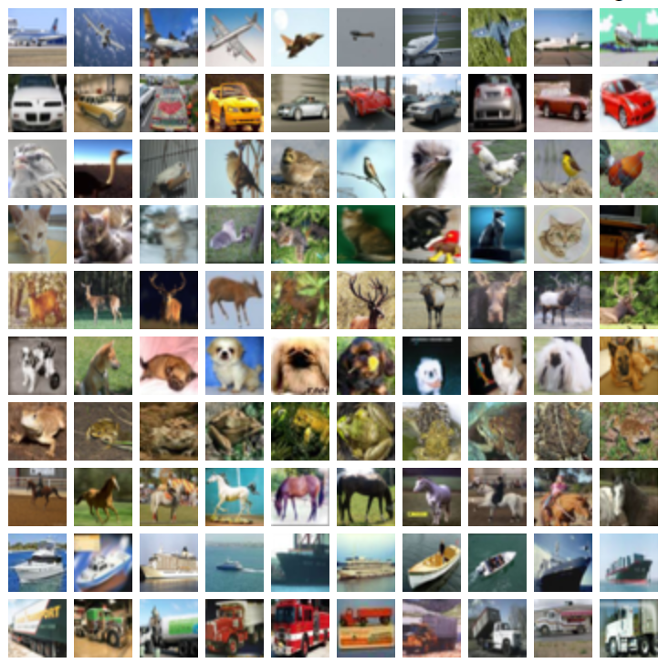

# Assignment 2 Instructions

This assignment is geared towards letting you guys be familiar with building models in Keras using a Sequential() model, pairing this model with Talos. As such, this homework is very similar to the tutorial.

Like in the tutorial, we will be using Talos as a means to find the best hyperparameters for the model *without needing any prior knowledge as to which hyperparameters are best to use*. This is an easy to get a good performing model given that you have enough time to test hyperparameter permutations. As you progress through the course and in your experience in creating machine learning models, you'll get a better feel for which hyperparameters are best to use for what data.

For this homework, you will be using the CIFAR-100 dataset that is provided within this folder (they're binary files named "train" and "test"). The CIFAR-100 dataset is a collection of small images that all get classified to 100 categories.



More information on this dataset can be found [here](http://www.cs.utoronto.ca/~kriz/cifar.html)

## 1.
Download the CIFAR-100 dataset found within Canvas. Sadly, the dataset (at ~150mb) is not on GitHub as it does not fit within their file size limits of 100mb. Move this data (```train``` and ```test```) to your project directory.

Below, you are provided with code on how to load the data (which is similar to the instructions provided in the CIFAR website). As such, you will not be needing to make a train-test split yourself, etc.

Here is the code:
```python
import pickle
with open('train', 'rb') as file:
    train_dict = pickle.load(file, encoding='bytes')

with open('test', 'rb') as file:
    test_dict = pickle.load(file, encoding='bytes')

X_train = train_dict[b'data']
y_train = train_dict[b'coarse_labels']

X_test = test_dict[b'data']
y_test = test_dict[b'coarse_labels']

y_train = tf.keras.utils.to_categorical(y_train, 100)
y_test = tf.keras.utils.to_categorical(y_test, 100)
```
With this, you already have your train test split. As you can see, we have 100 categories as answers.

## 2.
I will be providing you with your parameter dictionary for Talos:
```python
p = {
    'units': [120, 240],
    'hidden_activations': ['relu', 'sigmoid'],
    'activation': ['softmax', 'sigmoid'],
    'loss': ['mse', 'categorical_crossentropy'],
    'optimizer': ['adam', 'adagrad'],
    'batch_size': [1000, 2000]
}
```

## 3.
The model you will build for the project is very much like what is found in the tutorial, but with some differences as instructed in steps 3 - 7.

Unlike in the tutorial, you do not need a "Flatten" layer for an input layer, as the image data is already flattened to a 1-dimensional array. As such, your input layer may be a Dense layer with ```units=param['units']```.

## 4.
Add at least 5 Dense layers as hidden layers to your model. Remember that more and more hidden layers doesn't necessarily mean higher accuracy, and that more hidden layers increases computational and memory cost.

## 5.
As you see in the previous step 2, unlike the tutorial there is a new key within your parameter dictionary named ```'hidden_activations'```. Within your hidden layers, I would like you to set the your hidden layers' ```activation``` to the activations found above using ```param['hidden_activations']```.

## 6.
Note that we are using ```to_categorical``` for our labels. Like as what is mentioned in the tutorial, **pay attention to your output layer units/nodes** Please refer to the tutorial if you do not know what I mean.

## 7.
Set your number of ```epochs``` for training to ```200```.

## 8 (optional).
Look at the .csv output found within ```talos_output```! You can view it within a spreadsheet application (e.g. Excel, Google Sheets, etc.) to sort the columns if you would like. Additionally, if you know how to use Jupyter notebooks, you can use code like this to see your data in an easy-to-look-at table:

```python
%matplotlib inline
import talos
import matplotlib.pyplot as plt
r = talos.Reporting('<yourfile>.csv')
r.table("accuracy")
```


**Note: do not expect accuracy like this. This was done on data that was not images. As previously mentioned in class, MLP networks do not do very well on images.**


# Grading rubric
**Out of 100 points**
- 10 points: Load the dataset properly
- 20 points: Have the neural network train
- 20 points: Have the correct ```param['dict_keys']``` in the right layers/places in the model, the correct # of epochs, etc.
- 40 points: Include a .csv of your Talos output with *all 64 permutations* included.
- 10 points: On your best performing hyperparameter permutation, for every accuracy (*not validation accuracy*) point below 20%, lose 1 point. *This is a very low bar just so that you know you're not doing something wrong*.
  - For example, if your best performing hyperparameter permutation gets 12% accuracy, you will get an 8 point deduction.
