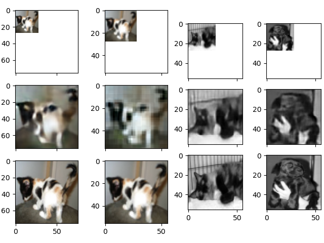

# Assignment 3 Instructions

In this assignment, we will try to break the bounds of classification and do something that is more interesting - image upscaling.

You will be creating a simple image upscaler using a convolutional autoencoder. As such, you will be training a neural network to turn a dog/cat 28x28 image to *at least* 56x56

## 1.
Download the dataset provided. The dataset is segmented into training and testing. Note that the labels denoting if an image is a dog or a cat (through the filenames) of the images will not matter, as we will not be doing a classification. Due to this, do not segment your data into dog and cat categories.

## 2.
Process your images:
  - Your training data should be 28x28.
  - You can process your images to be black and white, or you can use the full RGB. Using black and white will yield better results for the simple autoencoders that we are using.

## 3.
Beware of time. The training of the data took ~50 minutes on a Nvidia GTX 1080Ti (which for consumer cards is close to the top for most powerful GPU available). If you do not have a powerful GPU, keep in mind that this time could be a lot higher. Tweaking the neural network hyperparameters to get a meaningful result may cause you to multiply 50 minutes training by a lot.
  - I strongly recommend you to save your *X* and *y* arrays using ```numpy.save('enter_filename.npy', <variable name of array>)``` and then load them using ```<variable name of array> = numpy.load('enter_filename.npy')```. This will save you a lot of time from loading, reprocessing, and pushing to an array 25000 images over and over again.

## 4.
Keep this in mind as you are going through the following steps (even if right now it doesn't make a lot of sense): **I heavily suggest** working backwards -- by this I mean create your neural network architecture first, find out the dimensionality of your output layer (through ```model.summary()```, at the bottom of the print out), and then resize your images to the dimensionality of your decoder's output layer.

## 5.
Create an autoencoder similar to the one found in the tutorial that will *upscale* the image to *at least* 56x56.
  - Note that you are making an *upscaler*, therefore you need to *track the dimensionality of the data as in gets upsampled*. Do this using ```model.summary()``` to get the dimensionalities of each layer.
  - A question that you may want to ask yourself: Should the decoder have more or less layers than the encoder? Should you upsample more or less than your pooling?
  - Hint: For the amount of filters within your convolutional layers, think about how much more features there are in a cat or dog image vs. an MNIST (white digit on black background) image.

## 6.
The results do not need to be that good, so do not fret if your results look worse than the original data, but bigger (see the results below)

## 7.
Here are the results of an autoencoder that was trained on images within the train folder, and is predicting off of images within the test folder (so we're not cheating). Top is original/Input, middle is generated by an autoencoder, and the bottom is ground truth.


From left to right:
 - "Good" (for this assignment) color upscaling to 76x76 (\~2.7x scaling)
 - A more primitive (very similar to tutorial architecture) color upscaling to 56x56
 - "Good" (for this assignment) black and white upscaling to 56x56.



Code used to generate a visualization of the prediction:

```py
from tensorflow.keras.models import load_model
import numpy as np
from PIL import Image
import matplotlib.pyplot as plt
from tensorflow.keras.preprocessing.image import array_to_img

model = load_model('data/model.hdf5')
orig_image = Image.open('data/test1/12000.jpg')

pred_image = np.array(orig_image.copy().resize((28, 28)))
generated = model.predict(pred_image.reshape((1, 28, 28, 1)))
truth = orig_image.copy().resize((56, 56))
generated_image = np.reshape(generated, (56, 56, 3))
generated_image = array_to_img(generated_image)
generated_image = np.array(generated_image)
f, (ax1, ax2, ax3) = plt.subplots(3, sharex=True, sharey=True)
ax1.imshow(pred_image)
ax2.imshow(generated_image)
ax3.imshow(truth)
plt.show()
```

## 8.
Be creative! If you have some pre- or post-processing tactic that you think will help output better results, do it!

# Grading rubric
**Out of 100 points**

Originally, this homework was planned to have a distance metric from the ground truth to the generated output as a bulk of the final grade. However, due to current circumstances we will not be doing this, as there are techniques that we will be skipping over that will help better your output. As such, here is the following grading rubric:

- 10 points: Load the dataset properly
- 50 points: Have the neural network train with proper upscaling of dimensions (at least 56x56)
- 30 points: The output of the trained neural network needs to look *representative* to the original data even if it doesn't look *good*. If it somewhat represents the original data then you will get full marks for this category.
- 10 points: Subjective grading of the quality of output. I will be pretty lenient in grading this due to the subjective nature.
