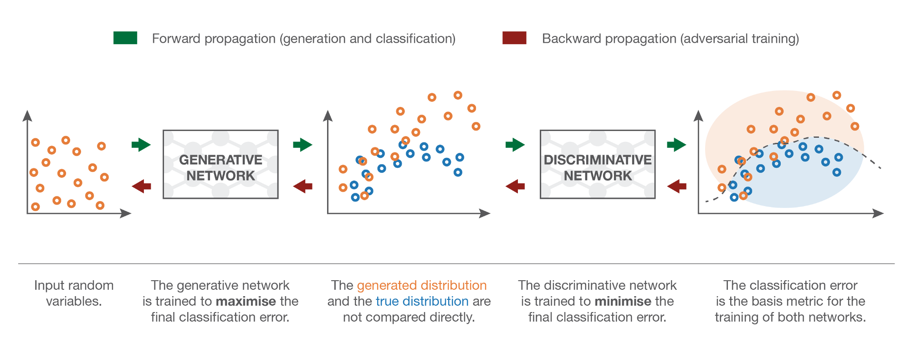
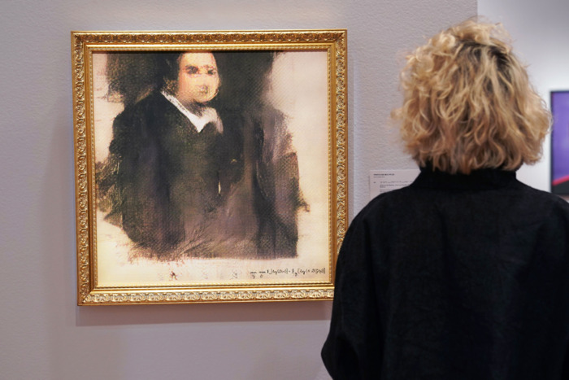
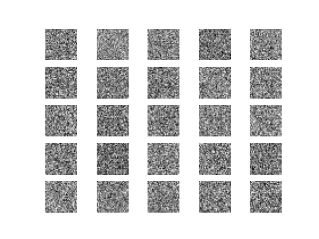
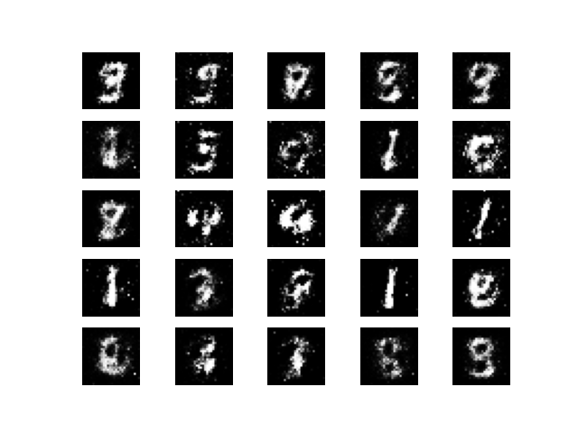
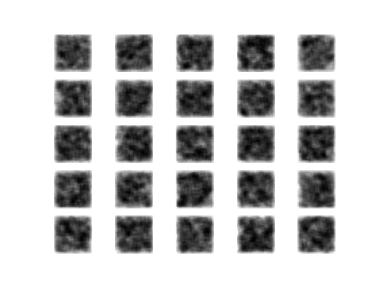

# Generative Adversarial Networks
## Short Reading
### Overview
Generative adversarial networks (GANs) are probably one of the most interesting architectures to have come out of machine learning. Instead of having neural networks that simply extract information out of data to infer patterns for generalization, two neural networks essentially battle (they're adversarial) each other ~for supremacy~ to generate/produce new data that are very believable.


<sub> All the above faces are fake and generated from a GAN. These people do not exist. </sub>

One of the two neural networks is the *generator*, which generates new information original data. Its goal is to be able to train to be good at making something similar to the original data, and more specifically, *maximize the classification error* between true and its own generated data when passed into the discriminator.

The original data as well as *generator* generated data is fed into what is called a *discriminator*, whose goal is to identify which images is real and which image is the fake generated image, and more specifically, *minimize the final classification error*.

Ideally, as the GAN trains...
- The generator starts making data that are very identical to the original data in the training dataset, with minimal flaws, that it becomes difficult to tell whether the data is generated (fake) or real.
- The discriminator becomes so good at noticing flaws within the generator-generated data that it starts learning what exactly is true data in comparison to generated (fake) data.

From the above, ideally the generator will have to train further to minimize its flaws so that the images become more dataset-like and fool the discriminator, and the discriminator has to find flaws so that it doesn't get fooled by the generator.

In summary, they essentially "fight" each other with "opposing" goals which end up making for better forms of themselves.




### Example generations of GANs
As you have seen from the fake faces above, GANs have incredible capability to create very realistic fake data. As such, they have multiple applications most especially in ones that require the creation of something new, like art.

#### 1.

My first example is from "High-Resolution Image Synthesis and Semantic Manipulation with Conditional GANs." As you can see by (a), (b), and (c) below, none of these images are real but instead generated by a GAN. They're given shapes that represent labels similar to what you see in the bottom left corner of (a):
- Blue shapes that represent cars
- Pale purple shapes that represents the road
- Magenta shapes that represents the sidewalk
- Green shapes that represents trees
- etc.

And the GAN just "colors" these shapes into the labels that they represent like the prodigy 3-year-old toddler that it is.


You can find more information about this in [this paper](https://arxiv.org/pdf/1711.11585.pdf).

#### 2.

Second up: art that sold for $400,000. It looks terrible. Not going to explain it further, but it does pose an interesting question: can AI finally start replicating "creativity?"



You can find more information about this in [this article](https://www.vulture.com/2018/10/an-artificial-intelligence-artwork-just-sold-for-usd400-000.html).

#### 3.

In case you lost hope with neural networks being able to do super-resolution from the last homework, GANs are currently the preferred method for generating super-resolution images. For your reference, bicubic resizing is the algorithm you'd normally find in typical image editors like GIMP or Adobe Photoshop. What you see here is 4x upscaling, and SRGAN is the proposed GAN method :


You can find more information about this in [this paper](https://arxiv.org/pdf/1609.04802.pdf).


### GAN Deeper Dive
If you'd like to know more about GANs in a deeper level, this is a good resource that is not incredibly difficult to read that walks you through the thought process of the inception of GANs.

https://towardsdatascience.com/understanding-generative-adversarial-networks-gans-cd6e4651a29

## GAN Tutorial

This is a simpler version found of a multi-layer perceptron based GAN found  [here](https://github.com/eriklindernoren/Keras-GAN/blob/master/gan/gan.py). As usual, the code was written in a way that's quite different to what we have normally covered, so I've simplified it a little bit and will be walking through it.

Here are the libraries that we are importing. As you can see, we're using MNIST. Not only that, but we're making a generative adversarial network based on multi-layer perceptrons as you can see by the use of the ```Dense``` layer. Lastly, we will be adding normalization into the neural network through ```BatchNormalization```, which was talked about in assignment 3.

```py
from tensorflow.keras.datasets import mnist
from tensorflow.keras.layers import Input, Dense, Reshape, Flatten, \
    BatchNormalization, LeakyReLU
from tensorflow.keras.models import Sequential, Model
import numpy as np
import matplotlib.pyplot as plt
```

First, let's build our generator. As we can see, the generator takes a vector (of size 100) as an input. We'll be taking in a latent noise vector. The generators job is to create something ("model"/"carve") meaningful out of this noise vector - essentially creating new data. Note the lack of a ```generator.compile()``` statement unlike our previous models - we will be compiling the generator *in addition to* the discriminator later on.

```py
# Generator
generator = Sequential()
generator.add(Dense(256, input_dim=100))
generator.add(LeakyReLU(alpha=0.2))
generator.add(BatchNormalization(momentum=0.8))
generator.add(Dense(512))
generator.add(LeakyReLU(alpha=0.2))
generator.add(BatchNormalization(momentum=0.8))
generator.add(Dense(1024))
generator.add(LeakyReLU(alpha=0.2))
generator.add(BatchNormalization(momentum=0.8))
generator.add(Dense(np.prod((28, 28, 1)), activation='tanh'))
generator.add(Reshape((28, 28, 1)))
```

Next, we have our discriminator. It takes in an image (as seen by the Flatten first layer) and spits out a binary (as given by the sigmoid activation and singular node within the output layer). We *are* going to compile the discriminator, however, as we will be training the discriminator separately to the combined generator + discriminator model. This will make more sense as we go along.

```py
# Discriminator
discriminator = Sequential()
discriminator.add(Flatten(input_shape=(28, 28, 1)))
discriminator.add(Dense(512))
discriminator.add(LeakyReLU(alpha=0.2))
discriminator.add(Dense(256))
discriminator.add(LeakyReLU(alpha=0.2))
discriminator.add(Dense(1, activation='sigmoid'))
discriminator.summary()

discriminator.compile(loss='binary_crossentropy',
                           optimizer='adam',
                           metrics=['accuracy'])
```

Next, let's load the MNIST dataset. This may look a little weird in syntax, but essentially we are:
1. Throwing away all the data that ```mnist.load_data()``` returns *except for* the training data it has (and storing it into variable ```X_train```).
2. Rescaling the data from -1 to 1, in the same range as the ```tanh``` activation found within our generator.
3. Expanding the dimensionality of the MNIST data (this is optional, you can change in input shape of the models too)
  - Expanding on the third axis means a ```(28, 28)``` shaped array becomes ```(28, 28, 1)```
4. Making ground truths, where we make an array full of ```1``` for valid images, and an array full of ```0``` for the fake, generated images.

```py
# Load the dataset
(X_train, _), (_, _) = mnist.load_data()

# Rescale -1 to 1
X_train = X_train / 127.5 - 1.
X_train = np.expand_dims(X_train, axis=3)

# Adversarial ground truths
valid = np.ones((16, 1))
fake = np.zeros((16, 1))
```

Now, we're going to go ahead an create an image through the generator. In simple terms, we feed the generator a *latent noise vector*. It may sound complicated but you can think of it as feeding it noise data. This is what allows the variability of the generated output, as you're feeding the generator non-sensical data, but your forcing the generator to still generate something like the target data. Below, we can see that we are feeding the generator a 1-dimensional noise vector with 100 elements (this is apparent in ```noise = np.random.normal(0, 1, (16, 100))``` then ```gen_imgs = generator.predict(noise)``` in the training code block).

```py
z = Input(shape=(100,))
img = generator(z)
```

The following code is a little confusing - why are we setting ```discriminator.trainable = False```? As previously mentioned, we will be training the discriminator separately to the combined model; it actually has nothing to do with being able to train through the line ```d_loss_real = discriminator.train_on_batch(imgs, valid)``` and ```d_loss_fake = discriminator.train_on_batch(gen_imgs, fake)``` below. Instead, this parameter changes so that when the *combined* model is compiled (```combined.compile(loss='binary_crossentropy', optimizer='adam')```), we do not train the discriminator while we are training the combined model. We then combine the models and compile the models.

```py
discriminator.trainable = False
validity = discriminator(img)

combined = Model(z, validity)
combined.compile(loss='binary_crossentropy', optimizer='adam')
```

Now we train the model. Here is the breakdown:
1. First, randomly select an image to train the generator on
2. Create a latent noise vector (```noise = np.random.normal(0, 1, (16, 100))```)
3. Get the generator to generate from the noise vector an image based on what it already knows (this could be complete noise, or a coherent image depending how much training has already been done).
4. Train the discriminator on the generator generated images, and the discriminator generated images with ```0``` if fake and ```1``` if real from the ```valid``` and ```fake``` arrays we created in an above code block
5. Train the generator on, again, a latent noise vector as the input data and valid images as the target data.
6. Print out the losses of each.

```py
for epoch in range(10000):
    idx = np.random.randint(0, X_train.shape[0], 16)
    imgs = X_train[idx]

    noise = np.random.normal(0, 1, (16, 100))

    gen_imgs = generator.predict(noise)

    d_loss_real = discriminator.train_on_batch(imgs, valid)
    d_loss_fake = discriminator.train_on_batch(gen_imgs, fake)
    d_loss = 0.5 * np.add(d_loss_real, d_loss_fake)
    d_acc = round(float(d_loss[1]), 4)
    d_loss = round(float(d_loss[0]), 4)

    noise = np.random.normal(0, 1, (16, 100))
    g_loss = round(float(combined.train_on_batch(noise, valid)), 4)

    comb_str = "Epoch {:.5s}: {:.40s} | {} ".format(f"{epoch}{' ' * 100}",
                                                    f"Disciminator - Loss: {d_loss}, Acc: {d_acc} {' ' * 100}",
                                                    f"Generator - Loss: {g_loss}")
    print(comb_str)
```

This last piece of code is to generate some samples as it trains. The generated images look something like this:

|At epoch 0: | At epoch 9800: |
|---|---|
|| |

```py
    if epoch % 200 == 0:
        r, c = 5, 5
        noise = np.random.normal(0, 1, (r * c, 100))
        gen_imgs = generator.predict(noise)

        gen_imgs = 0.5 * gen_imgs + 0.5

        fig, axs = plt.subplots(r, c)
        cnt = 0
        for i in range(r):
            for j in range(c):
                axs[i, j].imshow(gen_imgs[cnt, :, :, 0], cmap='gray')
                axs[i, j].axis('off')
                cnt += 1
        fig.savefig("images/%d.png" % epoch)
        plt.close()
```

This code can actually be adapted to use a convolutional neural network that is similar to what we've seen in previous homeworks as a generator and discriminator instead of using a multi-layer perceptron. Here is what that output looks like; notice how the generated image is different between an untrained CNN vs. an untrained MLP thanks to the various convolutions and upsampling layers:

|At epoch 0: | At epoch 8200: |
|---|---|
|| |


Here would be your entire code:
```py
from tensorflow.keras.datasets import mnist
from tensorflow.keras.layers import Input, Dense, Reshape, Flatten, \
    BatchNormalization, LeakyReLU
from tensorflow.keras.models import Sequential, Model
import numpy as np
import matplotlib.pyplot as plt

# Generator
generator = Sequential()
generator.add(Dense(256, input_dim=100))
generator.add(LeakyReLU(alpha=0.2))
generator.add(BatchNormalization(momentum=0.8))
generator.add(Dense(512))
generator.add(LeakyReLU(alpha=0.2))
generator.add(BatchNormalization(momentum=0.8))
generator.add(Dense(1024))
generator.add(LeakyReLU(alpha=0.2))
generator.add(BatchNormalization(momentum=0.8))
generator.add(Dense(np.prod((28, 28, 1)), activation='tanh'))
generator.add(Reshape((28, 28, 1)))

# Discriminator
discriminator = Sequential()
discriminator.add(Flatten(input_shape=(28, 28, 1)))
discriminator.add(Dense(512))
discriminator.add(LeakyReLU(alpha=0.2))
discriminator.add(Dense(256))
discriminator.add(LeakyReLU(alpha=0.2))
discriminator.add(Dense(1, activation='sigmoid'))
discriminator.summary()

discriminator.compile(loss='binary_crossentropy',
                           optimizer='adam',
                           metrics=['accuracy'])

# Load the dataset
(X_train, _), (_, _) = mnist.load_data()

# Rescale -1 to 1
X_train = X_train / 127.5 - 1.
X_train = np.expand_dims(X_train, axis=3)

# Adversarial ground truths
valid = np.ones((16, 1))
fake = np.zeros((16, 1))

z = Input(shape=(100,))
img = generator(z)
discriminator.trainable = False

validity = discriminator(img)

combined = Model(z, validity)
combined.compile(loss='binary_crossentropy', optimizer='adam')

for epoch in range(10000):
    idx = np.random.randint(0, X_train.shape[0], 16)
    imgs = X_train[idx]

    noise = np.random.normal(0, 1, (16, 100))

    gen_imgs = generator.predict(noise)

    d_loss_real = discriminator.train_on_batch(imgs, valid)
    d_loss_fake = discriminator.train_on_batch(gen_imgs, fake)
    d_loss = 0.5 * np.add(d_loss_real, d_loss_fake)
    d_acc = round(float(d_loss[1]), 4)
    d_loss = round(float(d_loss[0]), 4)

    noise = np.random.normal(0, 1, (16, 100))
    g_loss = round(float(combined.train_on_batch(noise, valid)), 4)

    comb_str = "Epoch {:.5s}: {:.40s} | {} ".format(f"{epoch}{' ' * 100}",
                                                    f"Disciminator - Loss: {d_loss}, Acc: {d_acc} {' ' * 100}",
                                                    f"Generator - Loss: {g_loss}")
    print(comb_str)

    if epoch % 200 == 0:
        r, c = 5, 5
        noise = np.random.normal(0, 1, (r * c, 100))
        gen_imgs = generator.predict(noise)

        gen_imgs = 0.5 * gen_imgs + 0.5

        fig, axs = plt.subplots(r, c)
        cnt = 0
        for i in range(r):
            for j in range(c):
                axs[i, j].imshow(gen_imgs[cnt, :, :, 0], cmap='gray')
                axs[i, j].axis('off')
                cnt += 1
        fig.savefig("imagesmlp/%d.png" % epoch)
        plt.close()

```
