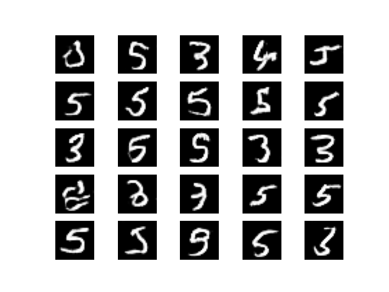

# Bonus Assignment 5 Instructions

In this assignment, you'll be adapting the code found within the tutorial and changing the generator and discriminator to use a CNN architecture instead of MLP. Everything else - including dataset and data pre-processing remain the same. As this is a bonus opportunity, this assignment is a lot more difficult than the others.

## Hint 1.
My generator had the following first few layers:
```py
generator.add(Dense(128 * 7 * 7, activation="relu", input_dim=100))
generator.add(Reshape((7, 7, 128)))
generator.add(UpSampling2D())
```

## Hint 2.
My discriminator had the following first layer:
```py
discriminator.add(Conv2D(32, (3, 3), input_shape=(28, 28, 1), activation='relu'))
```

# Grading rubric
**Out of 100 points**

- 10 points: Load the dataset properly
- 50 points: Have the neural network train.
- 40 points: Have the neural network generate something better than the results found within the MLP GAN in the instructions. It should look something similar (or better) than this baseline:

