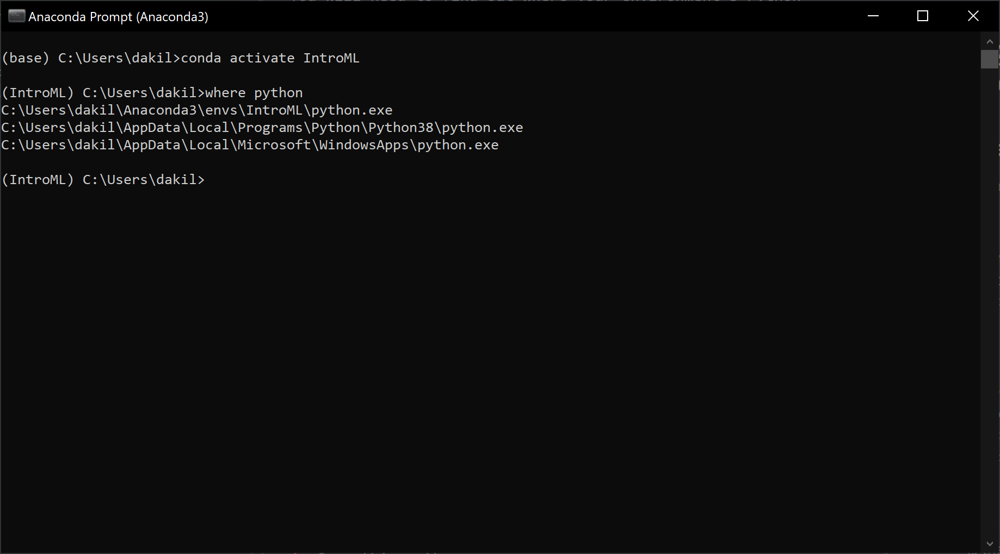
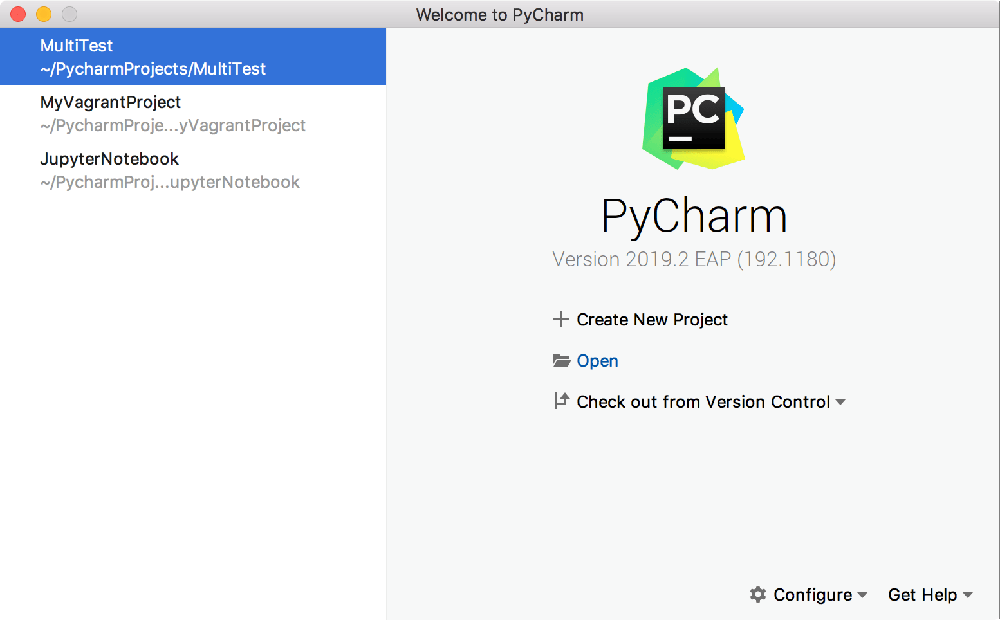
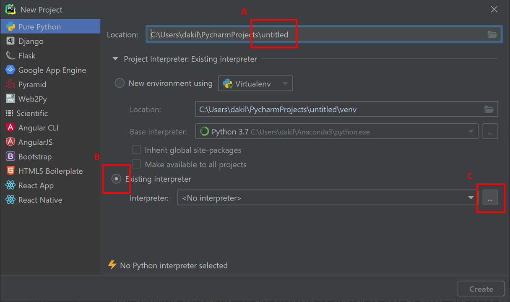
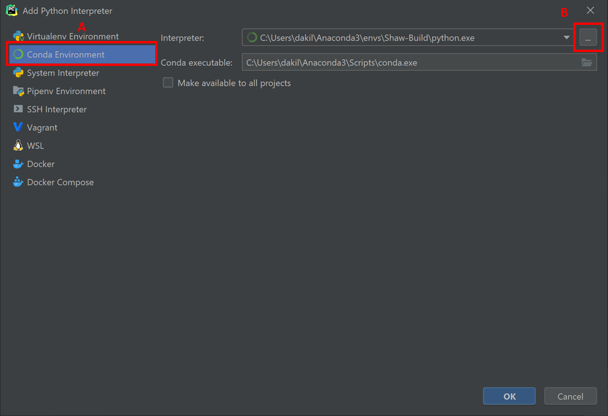
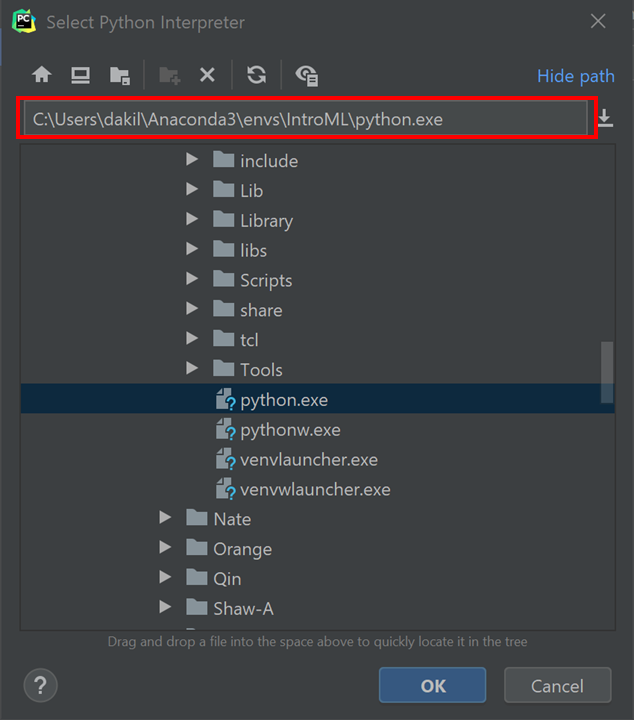
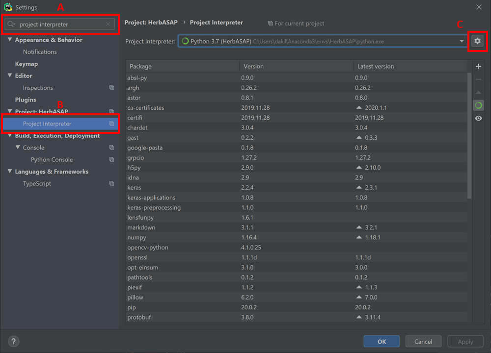
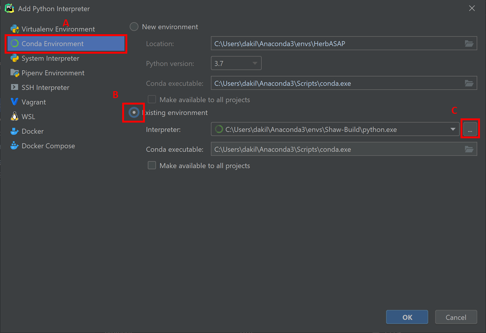

## Setting up PyCharm to work with an Anaconda environment
### Start here:
You will need to find out where your environment's Python interpreter is installed. In order to do this, follow these steps
(this is assuming you are running Windows)

1. Open an Anaconda Prompt (**not** an Anaconda Powershell Prompt -- for whatever reason it doesn't work in the Powershell version).
  - You can determine which prompt you're using through the title bar of your command line window, it will say either "Anaconda Prompt" or "Anaconda Powershell Prompt". If it says "Anaconda Prompt," proceed to step 2.
2. Determine if you made an environment or not when following the setup guide:
  - If you did not make an environment, skip to step 3.
  - If you did make an environment, type ```conda activate <your_environment_name>```. For this class, it is most likely ```conda activate IntroML```.
3. Type ```where python```. It should give you a list of paths. The path with ```\env\``` is the one you want. In the screenshot below, you can see that this is ```C:\Users\dakil\Anaconda3\envs\IntroML\python.exe```


4. Copy this path. You will need to so that PyCharm knows which interpreter to use.

5. Do you already have a PyCharm project created?
  - If you do not have a PyCharm project created, follow this link: [Create PyCharm project to work with Anaconda](#connect-pycharm-to-anaconda-from-scratch)
  - If you do have a PyCharm project created, follow this link: [Configure PyCharm project to use an Anaconda environment](#configure-pycharm-project-to-use-an-anaconda-environment)

### Connect PyCharm to Anaconda from scratch
1. Create a PyCharm project. If this is your first time setup, you should see a button to "Create a project"




2. You should now see the window in the following screenshot. Follow these steps:
  - A) Name your project
  - B) Select "Existing interpreter"
  - C) Click this button that says "..."



3. You should now see the window in the following screenshot. Follow these steps:
  - A) Select "Conda Environment"
  - B) Click this button that says "..."



4. You should now see the window in the following screenshot. In the red box, paste the result of when you typed ```where python``` (from steps 1-4 in [Start Here](#start-here)). For me, it was ```C:\Users\dakil\Anaconda3\envs\IntroML\python.exe```



5. Click "OK" on all dialogs, and "Create" when back to the original "New Project" window.

6. You are done! When you install new libraries to this environment in the command line, it will properly update within your PyCharm project (no need to reconfigure).

### Configure PyCharm project to use an Anaconda environment

1. With your project open, click File -> Open. Alternatively, you can use ```Ctrl + Alt + S``` to open the settings (on Windows).

2. You should now see the window in the following screenshot. Follow these steps:
  - A) Type into this textbox "project interpreter"
  - B) Select "Project Interpreter"
  - C) Click this button with a gear button on it.
    - After clicking the gear button, click "Add..."



3. You should now see the window in the following screenshot. Follow these steps:
  - A) Click "Conda Environment"
  - B) Click the radio button next to "Existing environment"
  - C) Click this button that says "..."



4. You should now see the window in the following screenshot. In the red box, paste the result of when you typed ```where python``` (from steps 1-4 in [Start Here](#start-here)). For me, it was ```C:\Users\dakil\Anaconda3\envs\IntroML\python.exe```


5. Click "OK" on all dialogs.
6. You are done! When you install new libraries to this environment in the command line, it will properly update within your PyCharm project (no need to reconfigure).
